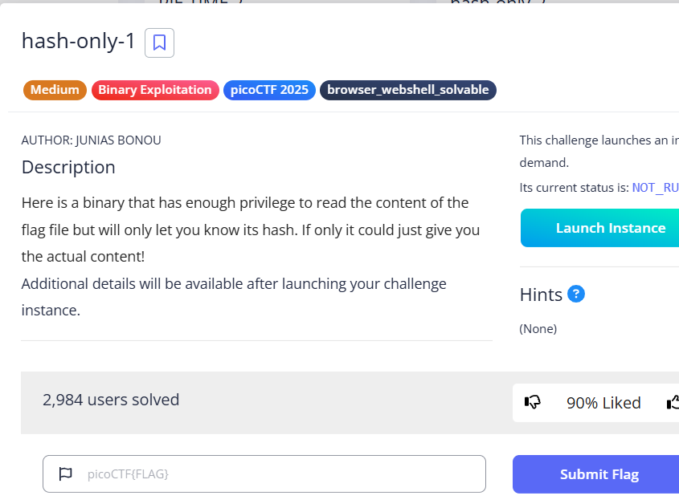
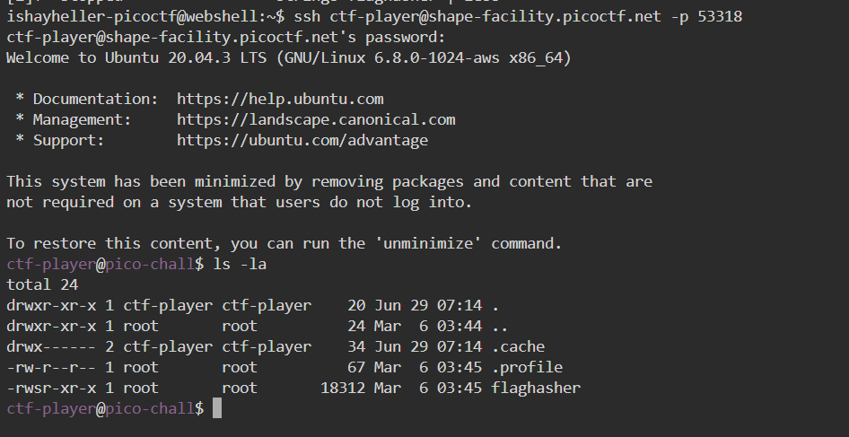
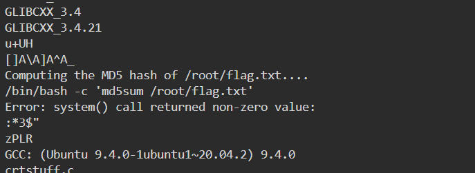
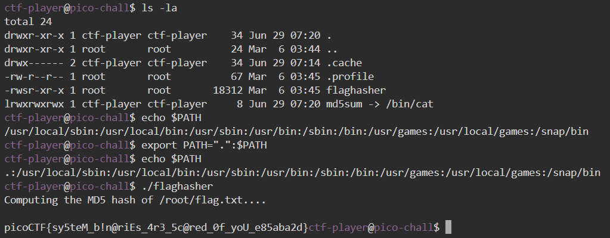
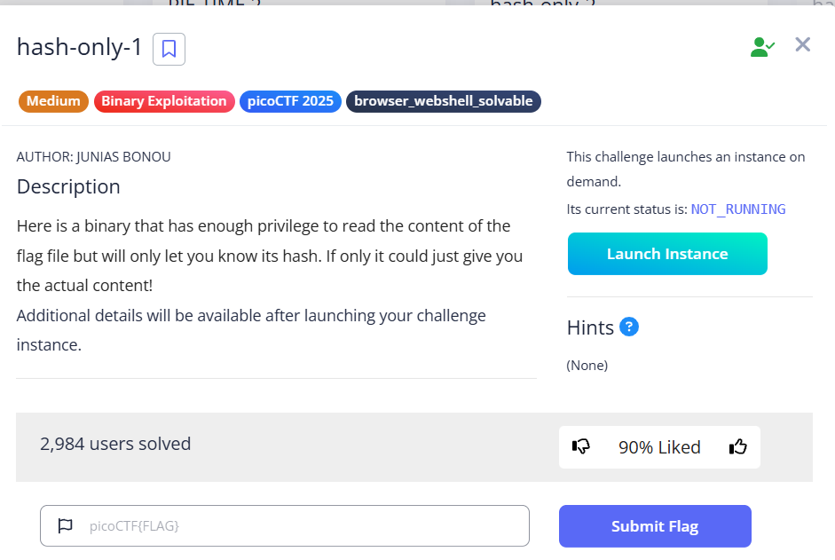

# hash-only-1 Writeup

## The Challenge


We're given a binary called `flaghasher` that can read `/root/flag.txt`, but instead of showing the flag, it only displays its MD5 hash. The challenge is to bypass this restriction and get the actual flag content.

## Description
The binary has setuid root permissions, meaning it runs with root privileges. It uses `system()` to execute `md5sum /root/flag.txt`. Our goal is to intercept this command execution.

## Hints
1. The binary uses `system()` which relies on the PATH environment variable
2. We can manipulate the command that gets executed
3. The setuid permission means we can read the flag through the binary

## Initial Investigation
First, we connect to the challenge instance:


After logging in, we examine the files:



Key observations:
- There's a binary named `flaghasher` with setuid permissions (`-rwsr-xr-x`)
- The binary is owned by root

When we run the binary normally:



It tries to execute `md5sum` but fails. This reveals it's using `system()` to call the md5sum command.

## The Solution
### Step 1: Understand the Vulnerability
The binary uses `system("md5sum /root/flag.txt")` which:
1. Searches for `md5sum` in directories listed in PATH
2. Executes the first `md5sum` it finds

### Step 2: Create a Fake md5sum
We'll create a symbolic link that makes `md5sum` actually run `cat`:
```bash
ln -s /bin/cat md5sum

### Step 3: Manipulate the PATH

export PATH=".:$PATH"

### Step 4: Execute and Get Flag

Now when we run the binary:



Instead of running the real md5sum, it:

- Finds our fake md5sum (which is actually cat)
- Executes cat /root/flag.txt
- Displays the flag contents directly

### The Flag

The complete flag is:  
picoCTF{sy5teM_b!n@riEs_4r3_5c@red_0f_yoU_e85aba2d}



### Why This Works

- **Setuid Privileges:** The binary runs as root, so it can read /root/flag.txt
- **PATH Injection:** By putting our directory first in PATH, we control what md5sum means
- **Command Substitution:** Our symlink makes md5sum execute cat instead
- **System() Behavior:** system() doesn't use absolute paths, allowing our attack


