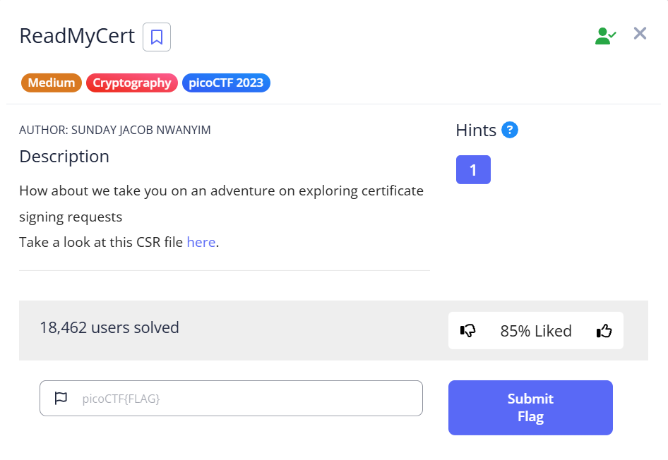
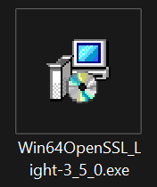
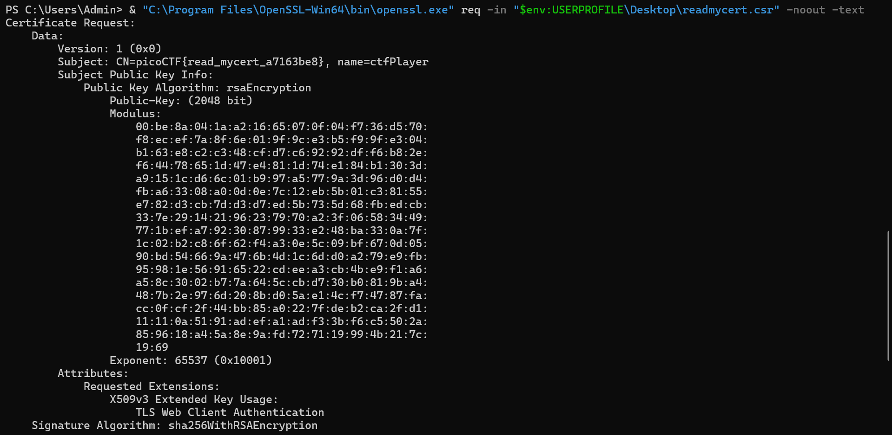
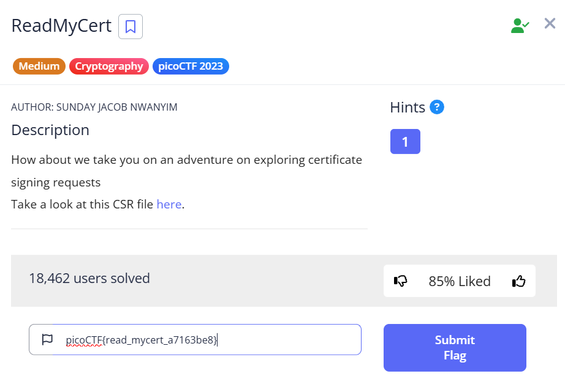

# 📜 picoCTF 2023 - ReadMyCert Challenge

## 🧩 Challenge Description

**Category:** Cryptography  
**Difficulty:** Medium  
**Name:** ReadMyCert  
**Description:**  
We are given a `.csr` file (Certificate Signing Request). The task is to extract information from the CSR and find the flag, which is hidden inside one of its certificate fields.

---

## 🚀 Solution Steps

### ✅ Step 1: Download the CSR file
The challenge provides a link to download a file named `readmycert.csr`.



---

### ✅ Step 2: Install OpenSSL on Windows
- Downloaded: `Win64 OpenSSL v3.5.0 Light`
- Link: [https://slproweb.com/products/Win32OpenSSL.html](https://slproweb.com/products/Win32OpenSSL.html)
- During installation: Selected option to add OpenSSL to system PATH




---

### ✅ Step 3: Run the OpenSSL command to read the CSR

Placed the file on the Desktop and ran:
```powershell
& "C:\Program Files\OpenSSL-Win64\bin\openssl.exe" req -in "$env:USERPROFILE\Desktop\readmycert.csr" -noout -text
```



---

### ✅ Step 4: Extract the flag

In the CSR output, found the line:
```
Subject: CN = picoCTF{read_mycert_a7163be8}, name = ctfPlayer
```

🎯 **Flag:** `picoCTF{read_mycert_a7163be8}`


---

### ✅ Step 5: Submit the Flag

Copy the flag:
picoCTF{read_mycert_a7163be8}
Paste it in the flag submission box in the challenge page
Click "Submit Flag"




---

## 🏁 Conclusion

This challenge demonstrated how to manually inspect a Certificate Signing Request using OpenSSL on Windows, and how to overcome PATH configuration issues when necessary.
