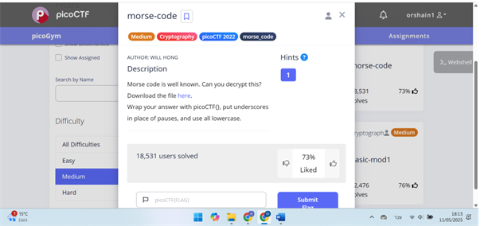

# morse-code
This is the write-up for the challenge "morse-code" in PicoCTF

# The challenge
## About Morse code (from Wikipedia - [Morse Code](https://en.wikipedia.org/wiki/Morse_code)):<br>
Morse code is a method used to encode text characters using sequences of short and long signals, called dots (·) and dashes (−). For example:<br>
•	Letter A is: ·−<br>
•	Letter B is: −···<br>
Spacing rules:<br>
•	Between dots and dashes in the same letter: no space.<br>
•	Between letters: short pause (or one space).<br>
•	Between words: long pause (or three spaces).<br>
Originally used in telegraphy and radio communications, Morse code is also used in emergency signaling.<br>

## description
The link of the challenge: https://play.picoctf.org/practice/challenge/280?category=2&difficulty=2&page=2
<br>
Go into the link.<br>
You should see this page:<br>
 
 
 
Download the audio file<br>
[audio](./util/morse_chal.wav)

## How to solve it
To decode a Morse code audio:
1.	Detect the beeps (usually sine tones).
2.	Measure their duration and spacing.
3.	Convert durations to dots (short) and dashes (long).
4.	Translate Morse code symbols into readable text.

Python code for solving the problem:
```python
"""Robust Morse Decoder with Error Handling"""
from pydub import AudioSegment
import numpy as np

# Load and preprocess audio
audio = AudioSegment.from_wav(r'C:\Users\orsha\Downloads\morse_chal.wav')
audio = audio.set_channels(1)
samples = np.array(audio.get_array_of_samples()).astype(np.float32)
samples /= np.max(np.abs(samples))  # Normalize

# Envelope detection
envelope = np.abs(samples)
window_size = int(0.02 * audio.frame_rate)  # 20ms window
envelope = np.convolve(envelope, np.ones(window_size)/window_size, mode='same')

# Adaptive threshold
threshold = 0.2 * np.max(envelope[:int(0.5*audio.frame_rate)])  # Use first 500ms for calibration

# Edge detection with robust alignment
active = envelope > threshold
transitions = np.diff(active.astype(int))
onsets = np.where(transitions == 1)[0]
offsets = np.where(transitions == -1)[0]

# Ensure equal length of onsets and offsets
if len(onsets) > len(offsets):
    if envelope[-1] > threshold:  # Signal ends active
        offsets = np.append(offsets, len(envelope)-1)
    else:
        onsets = onsets[:len(offsets)]
elif len(offsets) > len(onsets):
    if envelope[0] > threshold:  # Signal starts active
        onsets = np.insert(onsets, 0, 0)
    else:
        offsets = offsets[:len(onsets)]

# Verify we have pairs
if len(onsets) != len(offsets):
    raise ValueError(f"Mismatched onsets ({len(onsets)}) and offsets ({len(offsets)})")

# Duration analysis with safety checks
durations = []
gaps = []
for i in range(len(onsets)):
    durations.append((offsets[i] - onsets[i]) / audio.frame_rate)
    if i < len(onsets)-1:
        gaps.append((onsets[i+1] - offsets[i]) / audio.frame_rate)

# Auto-calibrate timing
avg_dot = np.median([d for d in durations if d < np.median(durations)])
avg_dash = np.median([d for d in durations if d >= np.median(durations)])

# Build Morse code
morse_code = ""
for i, dur in enumerate(durations):
    morse_code += "." if dur < (avg_dot + avg_dash)/2 else "-"
    if i < len(gaps):
        if gaps[i] < 3*avg_dot:
            pass
        elif gaps[i] < 7*avg_dot:
            morse_code += " "
        else:
            morse_code += "   "

# Complete Morse dictionary
MORSE_DICT = {
    '.-': 'A', '-...': 'B', '-.-.': 'C', '-..': 'D', '.': 'E',
    '..-.': 'F', '--.': 'G', '....': 'H', '..': 'I', '.---': 'J',
    '-.-': 'K', '.-..': 'L', '--': 'M', '-.': 'N', '---': 'O',
    '.--.': 'P', '--.-': 'Q', '.-.': 'R', '...': 'S', '-': 'T',
    '..-': 'U', '...-': 'V', '.--': 'W', '-..-': 'X', '-.--': 'Y',
    '--..': 'Z',
    '-----': '0', '.----': '1', '..---': '2', '...--': '3',
    '....-': '4', '.....': '5', '-....': '6', '--...': '7',
    '---..': '8', '----.': '9',
    '.-.-.-': '.', '--..--': ',', '..--..': '?', '-.-.--': '!',
    '-....-': '-', '-..-.': '/', '.--.-.': '@'
}

# Robust decoding
def decode_morse(morse):
    words = morse.strip().split("   ")
    decoded = []
    for word in words:
        decoded_word = ""
        for letter in word.split():
            decoded_word += MORSE_DICT.get(letter, '�')
        decoded.append(decoded_word)
    return ' '.join(decoded)

# Results
print("Raw Morse:", morse_code)
print("Decoded:", decode_morse(morse_code))
```
<br>
Run the code and get:<br>
Raw Morse: .-- .... ....- --...   .... ....- --... ....   ----. ----- -..   .-- ..--- ----- ..- ----. .... --...<br>
Decoded: WH47 H47H 90D W20U9H7<br>
The challenge is solved.<br><br>
The flage is: picoCTF{wh47_h47h_90d_w20u9h7}


