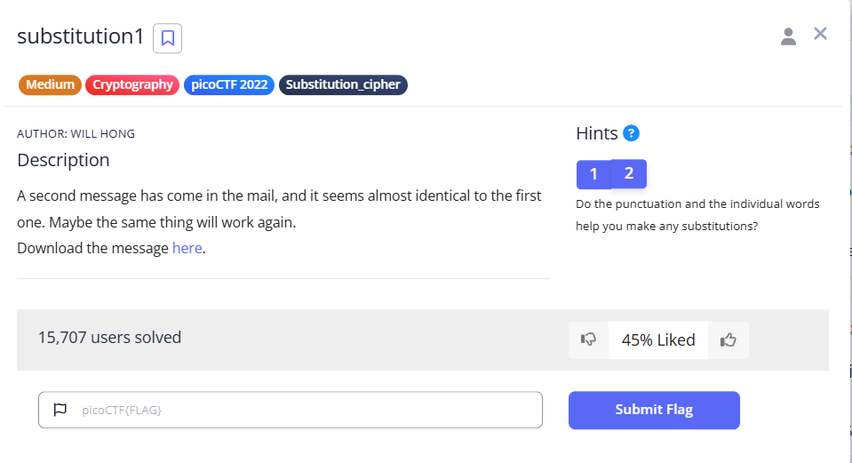
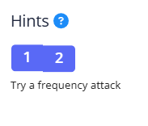
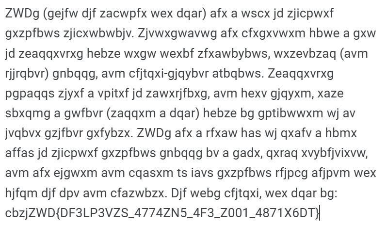
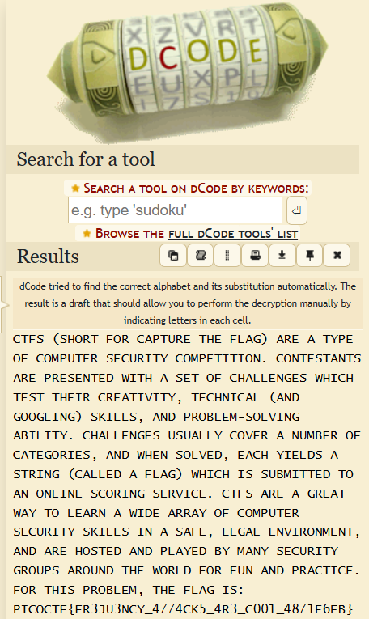

# substitution1

This is the write-up for the challenge **"substitution1"** in PicoCTF.

---

# The challenge

## Description

The link of the challenge: [https://play.picoctf.org/practice/challenge/308?category=2&difficulty=2&page=1](https://play.picoctf.org/practice/challenge/308?category=2&difficulty=2&page=1)

Go into the link.

You should see this page:



You can also check the hints provided by PicoCTF:

### Hint 1



### Hint 2


---

# How to solve it

At first, I tried to solve the substitution cipher manually. I began by attempting to create a key using **letter frequency analysis** and identifying likely patterns in the ciphertext.

### Step 1: Start with the Flag Format

The end of the ciphertext contained a string in the format `cbzjZWD{...}`. Based on previous challenges, I assumed this was the start of a flag like `picoCTF{...}`.

From this, I got the initial key mappings:

| Cipher | Plain |
|--------|-------|
| c      | p     |
| b      | i     |
| z      | c     |
| j      | o     |
| Z      | C     |
| W      | T     |
| D      | F     |

Applying these known substitutions to the ciphertext revealed parts of the plaintext. 
---

### Step 2: Use a Smarter Tool (dCode)

Realizing that continuing manually would take a long time, I used the [dCode Monoalphabetic Substitution Solver](https://www.dcode.fr/monoalphabetic-substitution), which is based on the **MCMC** (Markov Chain Monte Carlo) algorithm.

---

## What is the MCMC technique?

MCMC is a statistical method that works well for monoalphabetic substitution ciphers. It works like this:

1. **Initialization**: Start with a random or frequency-based key.
2. **Evaluation**: Score how English-like the decrypted text is (using bigram frequencies, etc.).
3. **Modification**: Slightly alter the key (e.g., swap letters).
4. **Iteration**: Repeat and keep the best scoring key.
#  The Cipher File
---
Here’s what the encrypted message file looked like:


Using this method, the tool quickly found a near-complete key and readable plaintext:



---

### Final Touch: Human Adjustment

The tool gave me a flag, but it was rejected. I suspected that one of the letters in the key might be wrong. I noticed that the character `'j'` might actually be `'q'`, so I made the change manually — and it worked!


---

#  Final Flag

```
picoCTF{FR3QU3NCY_4774CK5_4R3_C001_4871E6FB}, the challange is solved.
```

